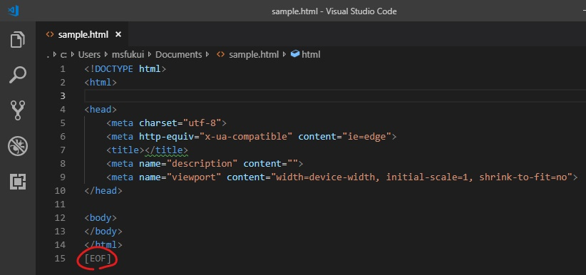

# eof-mark

This is a Visual Studio Code extention that adds the display of the [EOF] mark to the end of the file.

"[EOF] mark" is what is displayed at the end of "Hidemaru", "TeraPad" and other editors.

## Features

Simply, [EOF] is displayed in gray at the end of the opened editor.

## Requirements

Visual Studio Code 1.1.21 or later.

## Extension Settings

There is none.

## Release Notes

### 0.0.1

Initial release.

## License

MIT License.

[EOF]
